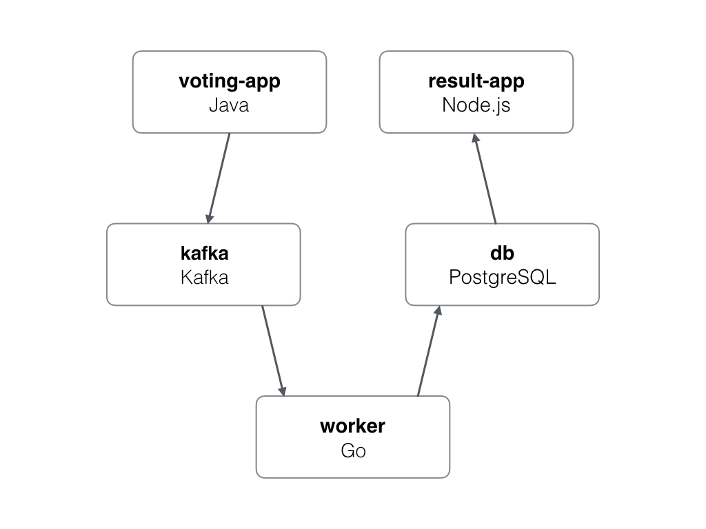

# Microservices Result

A demo application with Java, Go, Javascript, Kafka and PostgresQL using multi repo.

## Architecture



* A front-end web app in [Java](https://github.com/okteto/microservices-vote) which lets you vote between Tacos and Burritos
* A [Kafka](https://bitnami.com/stack/kafka/helm) queue which collects new votes
* A [Golang](https://github.com/okteto/microservices-worker) or worker which consumes votes from Kafka and stores them in PostgresQL
* A [PostgresQL](https://bitnami.com/stack/postgresql/helm) database
* A [Node.js](https://github.com/okteto/microservices-result) webapp which shows the results of the voting in real time

## Run the demo application in Okteto

```
$ git clone https://github.com/okteto/microservices-multi
$ cd microservices-multi
$ okteto deploy
```

## Develop on the Result microservice

```
$ git clone https://github.com/okteto/microservices-result
$ cd microservices-result
$ okteto up
```

## Develop on the Vote microservice

```
$ git clone https://github.com/okteto/microservices-vote
$ cd microservices-vote
$ okteto up
```

## Develop on the Worker microservice

```
$ git clone https://github.com/okteto/microservices-worker
$ cd microservices-worker
$ okteto up
$ make start
```

## Notes

The voting application only accepts one vote per client. It does not register votes if a vote has already been submitted from a client.

This isn't an example of a properly architected perfectly designed distributed app... it's just a simple
example of the various types of pieces and languages you might see (queues, persistent data, etc), and how to
deal with them in Okteto.
